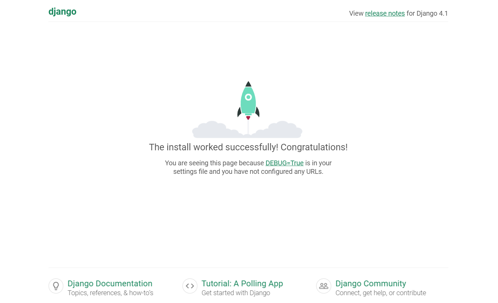

# Create Django Project

1. Start in root directory of project (the directory that will contain all of project code and our `manage.py`):
    * `pwd`
    * My sample directory:

        ```console
        PS C:\Users\FlynntKnapp\Programming\01-django-quickstart-project> pwd

        Path
        ----
        C:\Users\FlynntKnapp\Programming\01-django-quickstart-project

        PS C:\Users\FlynntKnapp\Programming\01-django-quickstart-project>
        ```

1. Create virtual environment and install Django:
    * `pipenv install django==4.1`
    * Sample console output:

        ```console
        PS C:\Users\FlynntKnapp\Programming\01-django-quickstart-project> pipenv install django==4.1
        Creating a virtualenv for this project...
        Pipfile: C:\Users\FlynntKnapp\Programming\01-django-quickstart-project\Pipfile
        Using C:/Program Files/Python311/python.exe (3.11.1) to create virtualenv...
        [==  ] Creating virtual environment...created virtual environment CPython3.11.1.final.0-64 in 2551ms
        creator CPython3Windows(dest=C:\Users\FlynntKnapp\.virtualenvs\01-django-quickstart-project-e7_C4Pkv, clear=False, no_vcs_ignore=False, global=False)
        seeder FromAppData(download=False, pip=bundle, setuptools=bundle, wheel=bundle, via=copy, app_data_dir=C:\Users\FlynntKnapp\AppData\Local\pypa\virtualenv)
            added seed packages: pip==22.3.1, setuptools==65.6.3, wheel==0.38.4
        activators BashActivator,BatchActivator,FishActivator,NushellActivator,PowerShellActivator,PythonActivator

        Successfully created virtual environment!
        Virtualenv location: C:\Users\FlynntKnapp\.virtualenvs\01-django-quickstart-project-e7_C4Pkv
        Creating a Pipfile for this project...
        Installing django==4.1...
        Pipfile.lock not found, creating...
        Locking [packages] dependencies...
        Locking [dev-packages] dependencies...                                                                                                                                                                                          
        Updated Pipfile.lock (c9c7d544ca3f1abd9c77a7a700900f8ac14c62a62f0860454fd1e5e7d9c21913)!
        Installing dependencies from Pipfile.lock (c21913)...
        To activate this project's virtualenv, run pipenv shell.
        Alternatively, run a command inside the virtualenv with pipenv run.
        PS C:\Users\FlynntKnapp\Programming\01-django-quickstart-project>
        ```

1. Activate virtual environment:
    * `pipenv shell`
    * Sample console output:

        ```console
        PS C:\Users\FlynntKnapp\Programming\01-django-quickstart-project> pipenv shell
        Launching subshell in virtual environment...
        PowerShell 7.3.1
        PS C:\Users\FlynntKnapp\Programming\01-django-quickstart-project>
        ```

1. Verify that Django is installed. Note line with `Django`:
    * `pip list`
    * Sample console output:

        ```console
        PS C:\Users\FlynntKnapp\Programming\01-django-quickstart-project> pip list 
        Package    Version
        ---------- -------
        asgiref    3.5.2
        Django     4.1
        pip        22.3.1
        setuptools 65.6.3
        sqlparse   0.4.3
        tzdata     2022.7
        wheel      0.38.4
        PS C:\Users\FlynntKnapp\Programming\01-django-quickstart-project>
        ```

1. Create Django project:
    * `django-admin startproject config .`
    * Note: The `.` at the end of the command tells Django to create the project in the current directory.
    * Sample console output:

        ```console
        PS C:\Users\FlynntKnapp\Programming\01-django-quickstart-project> django-admin startproject config .
        PS C:\Users\FlynntKnapp\Programming\01-django-quickstart-project>
        ```

1. Examine conents of new Django Project directory. We will, in the future, be modifying `settings.py` and `urls.py`:
    * `tree /f /a config`:
    * Sample console output:

        ```console
        PS C:\Users\FlynntKnapp\Programming\01-django-quickstart-project> tree /f /a config
        Folder PATH listing for volume Windows
        Volume serial number is 6867-B0EB
        C:\USERS\FLYNNTKNAPP\PROGRAMMING\01-DJANGO-QUICKSTART-PROJECT\CONFIG
            asgi.py
            settings.py
            urls.py
            wsgi.py
            __init__.py

        No subfolders exist

        PS C:\Users\FlynntKnapp\Programming\01-django-quickstart-project>
        ```

1. Test development server:
    * Note: The development server is running on port 8000 by default.  You can change the port by adding the port number to the end of the command, e.g. `python manage.py runserver 8010`.
    * `python manage.py runserver`
    * Sample console output:

        ```console
        PS C:\Users\FlynntKnapp\Programming\01-django-quickstart-project> python manage.py runserver
        Watching for file changes with StatReloader
        Performing system checks...

        System check identified no issues (0 silenced).

        You have 18 unapplied migration(s). Your project may not work properly until you apply the migrations for app(s): admin, auth, contenttypes, sessions.
        Run 'python manage.py migrate' to apply them.
        December 18, 2022 - 10:56:38
        Django version 4.1, using settings 'config.settings'
        Starting development server at http://127.0.0.1:8000/
        Quit the server with CTRL-BREAK.
        ```

1. Open the development server root URL in a browser and verify the Django greeen rocket is displayed:
    * <http://localhost:8000/>
    * Sample browser image:
        
    * Sample console output:

        ```console
        [18/Dec/2022 10:58:34] "GET / HTTP/1.1" 200 10681
        ```

1. We now have a basic Django project which runs on the development server and displays a confirmation page in the browser when `DEBUG=True` in `settings.py`.  We can now start adding functionality to our project in the next section.

1. Stop the development server:
    * `Ctrl+C`

1. You can now exit the virtual environment:
    * `exit`

1. You can now run the app in the future using the following terminal commands:
    1. `pipenv shell`
    1. `python manage.py runserver`

1. You can now exit the virtual environment in the future using the following terminal command:
    * `exit`
